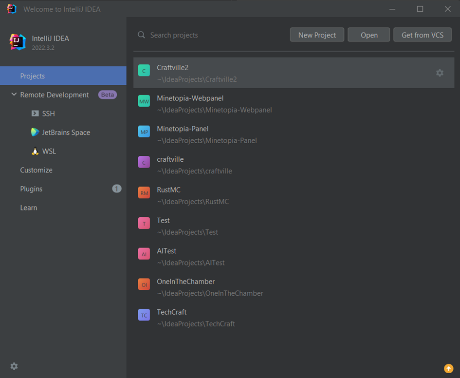
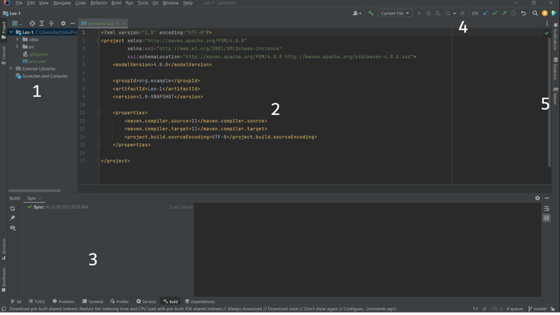
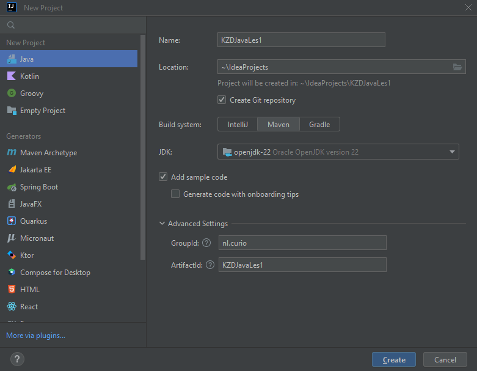

# Les 1: Java Basics #1 #

We gaan in deze les de eerste stappen zetten richting Java. Dit gaan we doen door een nieuwe editor te installeren, 
Intellij IDEA. Dit is een IDE van JetBrains. Deze is gratis te gebruiken onder de community editie.

## Opdracht 1 ##
Download en installeer de Jetbrains Intellij IDEA.
Deze is te vinden op de volgende link: https://www.jetbrains.com/idea/

## Opdracht 2 ##
Tijdens het installeren van de IDE, kunnen we kijken naar de verschillen en overeenkomsten tussen Java en C#.
C# zou je al eens gezien moeten hebben. En het mooie van deze twee talen is dat ze enorm veel op elkaar lijken!

Wanneer de IDE is geinstalleerd gaan we ons eerste project aanmaken. We maken een console app. En beginnen met een aantal basics. Classes, for loops, while loops, foreach loops, if, else, etc.

### De verschillen tussen Java en C# ###


#### Een aantal voorbeelden van de verschillen: ####

Links Java, Rechts C#

 - Java package, C# namespace
 - Java import, C# using
 - Java lowercase packages, C# PascalCase packages
 - Java camelCase methods, C# PascalCase methods
 - Java @Annotations, C# [Annotations]
 - Java {} op dezelfde line, C# {} op de volgende line

Verder zijn Java en C# op de voorgrond zo goed als identiek aan elkaar.

### Een snelle rondleiding in de nieuwe IDE: ###

Wanneer je de IDE opent zal het volgende scherm zichtbaar worden. Bij jullie zullen hier nog geen projecten staan. Bij mij al wel een aantal. Hier hebben we de optie om een nieuw project aan te maken. Een project op te halen van VCS (GitHub) Of een bestaand project te openen.



We drukken hier rechts boven op “New Project”.

Het volgende scherm wordt zichtbaar, hier kunnen we de velden voor ons nieuwe project invoeren.

 - Name: De naam van het project
 - Location: De locatie van het project
 - Create Git Repository: Een GIT repo maken, ja of nee
 - Language: De taal van het project
 - Build system: Het bouwsysteem van je project (We gaan hier later dieper op in)
 - JDK: De java versie

Wanneer je vervolgens op “Create” drukt. Kom je in de IDE zelf. Dit ziet er zo uit:
De IDE opent op de POM.xml. Dit is een bestand wat met Maven meekomt. Hierin kunnen we alle Dependencies opgeven. En het project compilen. Dit is verglijkbaar met NuGet, NPM, Composer en pip
Ik heb hier een aantal belangrijke punten van de IDE vermeld.
1.	De explorer. Hier staan alle bestanden van je project, je Java-, Maven-, en andere bestanden die in je project thuis horen.
2.	De code viewer/editor. Dit is het scherm waar we het meest in werken. Hier zie je de code van je project. En kan je deze bewerken.
3.	Je output/console/build log. Hier zie je de output van je applicatie wanneer je deze runt. Ook tijdens het builden/compilen van de applicatie met maven wordt de output hier weergeven.
4.	De interacties met je project. Hier staan onder andere de github commandos. (Pullen, Committen, Pushen) En de “run” knoppen.
5.	De Maven knop. Hier open je het Maven scherm. En kan je Maven acties uitvoeren. Denk hierbij aan het bouwen van je applicatie. Of het verversen van dependencies.



## Een eerste Java project maken: ##
Nu we de verschillen weten tussen Java en C#, en onze nieuwe IDE is geinstalleerd, en we deze een beetje kennen. Gaan we een nieuw project maken. 

- Doe dit net als in het voorbeeld hierboven. Noem het project **“KZDJavaLes1”**
- De Locatie kan je laten staan.
- Build system: Maven
- JDK: 17+ (Als je deze niet hebt. Druk dan op Download JDK, en selecteer een versie)
- Open het blokje advanced
- Vul bij groupId je package naam in. (Dit is meestal een site in de vorm van je bedrijfsnaam of gamertag, in mijn geval **nl.curio**, dit kan dus ook me.bkdev zijn, of com.github)



Wanneer je nu op “Create” drukt. Zal het project worden aangemaakt. En geopend worden in de IDE.
Als het goed is zal de Main class in je editor window worden geopend.
Is dit niet het geval, open de Main class dan zelf. Deze staat onder de src > main > java > <package naam> > Main.java

We zien hier een aantal dingen. Onder andere dat de “main” method al is aangemaakt. Dit is makkelijk. Dan kunnen we gelijk beginnen met programmeren.

### Lombok ###
Nu we ons eerste project hebben aangemaakt, kijken we gelijk naar een van de meest gebruikte libraries in Java. **Lombok**.
Lombok is een handige tool die het enorm makkelijk maakt om getters, setters en constructors te maken!

#### Lombok uitleg video ####
[](https://www.youtube.com/watch?v=LxSHSSRgy40)

#### Opdracht: Installeer Lombok ####
Bekijk de video hierboven. En volg de stappen van Jens, of volg de instructies hieronder.

- Navigeer naar je POM.xml, deze staat in de hoofdmap van je project.
- Zoek naar het </properties> blok. En plak de regels hieronder in het codeblok, onder dit blok.

```xml
<dependencies>
    <dependency>
        <groupId>org.projectlombok</groupId>
        <artifactId>lombok</artifactId>
        <version>1.18.30</version>
        <scope>provided</scope>
    </dependency>
</dependencies>
```

- Je pom.xml zier er nu zo uit:
- 
```xml
<?xml version="1.0" encoding="UTF-8"?>
<project xmlns="http://maven.apache.org/POM/4.0.0"
         xmlns:xsi="http://www.w3.org/2001/XMLSchema-instance"
         xsi:schemaLocation="http://maven.apache.org/POM/4.0.0 http://maven.apache.org/xsd/maven-4.0.0.xsd">
    <modelVersion>4.0.0</modelVersion>

    <groupId>MIJN_MOOIE_PACKAGE_NAME</groupId>
    <artifactId>MIJN_MOOIE_PROJECT_NAME</artifactId>
    <version>1.0-SNAPSHOT</version>

    <properties>
        <maven.compiler.source>11</maven.compiler.source>
        <maven.compiler.target>11</maven.compiler.target>
        <project.build.sourceEncoding>UTF-8</project.build.sourceEncoding>
    </properties>

    <dependencies>
        <dependency>
            <groupId>org.projectlombok</groupId>
            <artifactId>lombok</artifactId>
            <version>1.18.30</version>
            <scope>provided</scope>
        </dependency>
    </dependencies>
</project>
```

- Er verschijnt nu rechts boven een refresh knopje van maven. Druk hier op.
- Als deze niet verschijnt doe je rechter muisknop op pom.xml. En druk je op Maven > Reload Project

Dit zal de lombok dependency in je project laden. Wanneer dit is gebeurt kunnen we beginnen met programmeren.

## De eerste regels code ##
Ga terug naar je main.java. Probeer eerst zelf eens de output 1 tm 10 in je console te printen. Doe dit met een for-loop en een ``System.out.println();``

Run je code door rechts boven op het play knopje te drukken.

Werkt het?

## Opdrachten ##

TIP: Console input kan je ophalen door
```java
Scanner scanner = new Scanner(System.in);
scanner.nextInt(); // Haal de int op die in de console is getypt
scanner.nextLine(); // Haal de hele regel op die in de console is getypt
// Er zijn nog veel meet methodes om op te halen. Bekijk deze via je intellisense
```
### 1. Inhoud van een bak ###
Maak een programma dat als input vraagt: de lengte, hoogte en breedte van een bak.

Als output krijg je: de inhoud van de bak in liters.

### 2. Inhoud van een maatbeker ###
Maak een programma dat als input vraagt: de hoogte en straal van een cilinder (maatbeker).

Als output krijg je: de inhoud van de beker, in liters.

### 3. BTW berekenen ###
Als je iets koopt, betaal je daarover altijd belasting: de BTW. Voor vrijwel alle dingen geldt: je betaalt 21% BTW. Dat geldt wordt al belasting afgedragen. Er is ook een lager tarief, met name voor eten en drinken betaal je maar 9% BTW. Tenslotte zijn er dingen waarover je géén BTW betaalt, bijvoorbeeld over onderwijs (je lesgeld voor deze opleiding dus).

Maak een programma dat het eindbedrag kan berekenen. Het programma vraagt als eerste onder welk tarief het ding valt (met een keuzemenu). Daarna voer je de prijs in. Als output krijg je te zien: de prijs inclusief én exclusief BTW, en de precieze hoeveelheid BTW die je betaalt (zoals het ook altijd op een kassabonnetje staat vermeld).

### 4. Fizzbuzz ###
Het programma toont een reeks getallen van 1 t/m 30. Echter voor getallen die deelbaar zijn door 3 wordt niet het getal getoond, maar het woord “fizz”. Voor getallen die deelbaar zijn door 5 zie je “buzz”. Voor getallen die deelbaar zijn door 3 én 5 zie je “fizzbuzz”. Tip: gebruik de modulo-operator. Voorbeeld-output:

1<br />
2<br />
fizz<br />
4<br />
buzz<br />
fizz<br />
7<br />
8<br />
fizz<br />
buzz<br />
11<br />
fizz<br />
13<br />
14<br />
fizzbuzz<br />

### 5. Achtbanen ###
Sla de gegevens van deze achtbanen op in een lijst, en toon ze daarna allemaal op het scherm in de vorm “In 1981 werd de Python geopend in de Efteling”.

| Naam       | Park      | Bouwjaar |
|------------|-----------|----------|
| Python     | Efteling  | 1981     |
| Fenix      | Toverland | 2018     |
| Troy       | Toverland | 2007     |
| Baron 1898 | Efteling  | 2015     |
| Condor     | Walibi    | 1994     |
| Xpress     | Walibi    | 2000     |

### 6. Achtbaan toevoegen ###
Breidt het programma van 5 uit, zodat je vóór het tonen van de lijst via de Console nog een achtbaan kunt toevoegen aan de lijst. Bonuspunt als je meerdere achtbanen kunt toevoegen.

### 7. Achtbaan voorwaarden ###
Breid je programma van 5 en 6 uit, zodat er gevraagd wordt om 2 jaartallen in te voeren. Het programma toont daarna alleen nog maar achtbanen die gebouwd zijn tussen die twee jaartallen.

### 8. Omwisselen ###
Gegeven deze variabelen:

· string fizz = "buzz";

· string foo = "bar";

Schrijf een programma dat de inhoud van deze twee variabelen omwisselt. Zodat je een print(foo) als resultaat “buzz” zal geven. Gebruik zo min mogelijk regels.

### 9. Fibonacci ###
Schrijf een programma dat de rij van fibonacci als output geeft (minstens de eerste 20 getallen). Zie ook https://www.fibonicci.com/nl/rij-van-fibonacci/.

### 10. Letters Sorteren ###
Je programma vraagt als input één woord. Als output krijg je de letters van dat woord in alfabetische volgorde. Bijvoorbeeld:

· Input: “software”

· Output: “aeforstw”