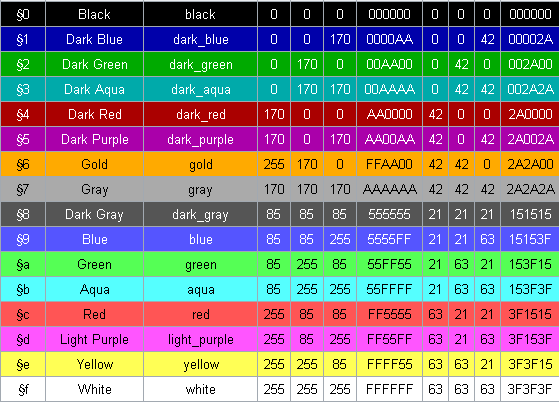

# Les 2: Minecraft / Paper basics #1 #

## Vorige les ##
[Les 1: Java Basics](/les1/readme.md)

### Dit zou je gedaan moeten hebben / moeten weten ###
- Intellij IDEA geïnstalleerd
- Project aangemaakt
- Lombok geïnstalleerd
- Eerste regels Java code geschreven

## Deze les ##

### Leerdoelen ###
- Weten wat Minecraft is
- Weten welke Minecraft serveropties we hebben
- Minecraft plugin voor Intellij
- Paper server opzetten
- Eerste Minecraft plugin
- Plugin bouwen
- onCommand argumenten
- Teleportatie commando
- Kleurcodes in messages


### Uitleg ###
In deze les gaan we onszelf verdiepen in Minecraft en Paper. We gaan de volgende dingen doen:
- De Minecraft plugin installeren voor Intellij IDEA
- Onze eerste paper server opzetten
- Onze eerste Minecraft plugin bouwen
- Ons eerste commando aanmaken


# Wat is Minecraft #
Vele van jullie zullen bekend zijn met het spel Minecraft. Maar voor de mensen die het niet kennen. Hier een korte uitleg

Minecraft is een sandbox-game. Dit betekent dat jij bepaald hoe het spel gaat. Je kiest je eigen route!

Zo kan je in de Minecraft-wereld, bestaande uit blokken. Zelf deze blokken hakken, plaatsen en bewerken. Zo kan je allerlei verschillende bouwwerken maken.
Dit kan lokaal. Of op een server, met je vrienden!

Verder heb je de mogelijkheid om tegen monsters te vechten. En bijvoorbeeld de wereld verkennen!

Kortom, Minecraft is eindeloos. En dit wordt nog veel leuker. Als je plugins kan maken.

# Minecraft Servers #

Allereerst gaan we kijken naar servers. Wat is een server? En waar wordt een server voor gebruikt?

Minecraft servers zijn simpel gezegd een gedeelde wereld. Spelers kunnen meedoen met deze wereld. En samen spelen.

Een van de meest bekende servers is Hypixel. Hypixel heeft allerlei verschillende gamemodes. Maar allemaal binnen Minecraft.

Zo heb je bijvoorbeeld skyblock, the pit, bedwars, en nog veel meer.

Deze servers zijn gemaakt met plugins. Plugins zijn software die je toevoegt aan je server. Plugins zijn in staat om bestaande functies binnen Minecraft te bewerken.
Zo kan je bijvoorbeeld maken. Dat als je rechter muisknop doet met een blaze rod. Dat er bliksem komt. Of een schaap spawnt.

## Welke serveropties hebben we ##

Binnen de categorie servers, hebben we een aantal opties. Ze doen voor de speler allemaal het zelfde. Maar werken op de achtergrond net anders.

### Server opties ###
- Vanilla: De standaard server van Minecraft. Deze kun je downloaden van [deze link](https://www.minecraft.net/en-us/download/server). - Deze server kan je niet uitbreiden met plugins.
- Bukkit: Bukkit is de eerste serve software die is gemaakt door derde partijen. Deze server kan je uitbreiden met plugins.
- Spigot: Spigot is een verder geoptimaliseerde versie van Bukkit. Deze werkt praktisch het zelfde. Alleen is deze beter geoptimaliseerd.
- Paper: Paper is dan weer een fork van Spigot. Paper past een aantal dingen aan. Waardoor deze nog sneller is!
- Minestom: Minestom is een bare bone server. Deze implementeert bijna niks van Minecraft. Je kan de game via Minestom dus bijna volledig aanpassen!

Zo zie je dat bijna alle servers afstammen van Bukkit. Er zijn ondertussen enorm veel forks op Paper. Die ieder zijn gespecialiseerd in eigen optimalisaties. Lang leven open source!

Voor ons is vooral de Bukkit API belangrijk. Of je deze nu via Bukkit, Spigot, Paper, Purpur, of wat voor fork dan ook benadert. Is je eigen keuze.

# Minecraft plugin voor Intellij #

Nu we weten wat servers zijn, en welke serveropties we hebben, gaan we de Minecraft plugin installeren voor Intellij IDEA.
Deze plugin zal er voor zorgen dat we makkelijk een project kunnen maken.

## Opdracht: Installeer de Minecraft plugin voor Intellij ##
- Navigeer naar File -> Settings -> Plugins
- Zorg dat je bovenaan op het tabje Marketplace drukt
- Zoek naar Minecraft Development
- Klik op installeren


# Paper server opzetten #

Als dit allemaal is gelukt. Kunnen we beginnen aan het echte werk. Een server opzetten!

## Opdracht: Paper server opzetten ##

### Paper jar downloaden ###
We beginnen met het downloaden van de paper server. Dit is een jar file.
Deze is te vinden op de website van paper. [Hierrrr](https://papermc.io/downloads/paper)
Download de versie waar je voor wil programmeren. In mijn geval is dit de versie 1.20.4.
Dit zal een bestand downloaden met de naam paper-1.20.4.jar.

Navigeer naar je documenten. En maak een nieuwe map aan genaamd servers.
Maak hierin nog een map genaamd dev-server-1. En plak hier de jar file die je net hebt gedownload. Noem deze ``server.jar``


### Batch script maken ###
De map waar onze jar file staat. Is de server map. In deze map gaan we een nieuw bestand aanmaken, genaamd ``start.bat``.

Dit doen we door de volgende stappen te volgen:
- Maak een nieuw txt bestand aan. Noem deze ``start.txt``
- Open dit bestand. En plak de volgende code
```shell
java -Xms1G -Xmx1G -jar server.jar noguih
pause
```
- Druk op opslaan als. En noem het bestand ``start.bat``

### Uitlegvideo ###
[](https://www.youtube.com/watch?v=wzbdnA-5Mwg)

Hier hebben we een aantal argumenten.<br/><br/>
* ```-xmx1G```: Dit is de maximale hoeveelheid RAM die de server mag gebruiken. Dit is 1GB.<br/>
* ```-xms1G```: Dit is de minimale hoeveelheid RAM die de server mag gebruiken. Dit is 1GB.<br/>
* ```-jar server.jar```: Dit is de jar die we willen uitvoeren. Dit is de jar die we net hebben gedownload.

### Server starten ###
We starten nu de server door het batch script te runnen. (start.bat)

Wanneer je geen jdk17 hebt geïnstalleerd zal je een foutmelding krijgen.
Om dit op te lossen kan je OpenJDK17 installeren via [Deze Link](https://aka.ms/download-jdk/microsoft-jdk-17.0.7-windows-x64.msi)

De eerste keer zal je opvallen dat er een eula.txt bestand wordt gegenereerd. 
Open deze in een text editor. En verander de waarde van eula van false naar true.

```txt
#By changing the setting below to TRUE you are indicating your agreement to our EULA (https://account.mojang.com/documents/minecraft_eula).
#Thu Sep 23 15:34:28 CEST 2021
eula=true
```
Start nu de server opnieuw op. En je zult zien dat de server opstart. En dat je een aantal bestanden in je map hebt gekregen. Waaronder een plugins map. Hierin kunnen we onze plugins plaatsen.


## Eerste Minecraft plugin ##

### Project aanmaken ###
We beginnen met een project aanmaken in Intellij met de Minecraft plugin. 

Dit doen we door naar File -> New -> Project te gaan. 

En hier te kiezen voor Minecraft Development, en dan voor Plugin. 

We geven het project een naam. En kiezen voor de laatste versie van Paper (1.20.4). 

Dan kiezen we voor Java 17. En klikken we op create.


### Plugin.yml ###
Als je het project opent, en kijkt onder src/main/java/resources zie je daar een bestand staan genaamd plugin.yml. Met dit bestand registreren we de specifieke info voor de plugin.
```yml
name: 'MyFirstPlugin' # Naam van de plugin
version: '1.0.0' # Versie van de plugin
main: 'me.<name>.myfirstplugin.MyFirstPlugin' # Main class van de plugin
api-version: 1.19 # Versie van de API
description: 'Les 2 plugin' # Beschrijving van de plugin
author: '<name>' # Auteur van de plugin
```

Hier kunnen we ook commandos registreren.

Commandos registreren doe je als volgt:
```yml
commands: # Commandos van de plugin
  heal: # Naam van het commando
    description: 'Heal commando' # Beschrijving van het commando
```

### Main class ###
Navigeer nu naar je main class. Deze staat onder src/main/java/me/<name>/myfirstplugin/MyFirstPlugin.java. Hierin staat al een stukje code. Dit is de code die wordt uitgevoerd als de plugin wordt geactiveerd. We gaan hier nu een commando aan toevoegen. Dit doen we door de volgende code toe te voegen:
```java
@Override
public void onEnable() {
    getCommand("heal").setExecutor(new HealCommand());
}
```

Dit stukje code zal een error geven. Dit komt omdat de class HealCommand nog niet bestaat. Deze gaan we nu aanmaken. Maak een nieuwe class aan. En noem deze HealCommand. Deze class moet de interface CommandExecutor implementeren. Dit doen we door de volgende code toe te voegen:
```java
public class HealCommand implements CommandExecutor {
}
```

Deze class zal nu een error geven. Dit komt omdat we de methode onCommand moeten implementeren. Dit doen we door de volgende code toe te voegen:
```java
@Override
public boolean onCommand(CommandSender sender, Command command, String label, String[] args) {
    return false;
}
```

Deze methode geeft een boolean terug. Deze boolean geeft aan of het commando is uitgevoerd. Of dat er een error is opgetreden. We gaan nu een speler healen. Dit doen we door de volgende code toe te voegen:
```java
@Override
public boolean onCommand(CommandSender sender, Command command, String label, String[] args) {
    if (sender instanceof Player) {
        Player player = (Player) sender;
        player.setHealth(20);
        player.sendMessage("Je bent gehealed!");
    }
    return false;
}
```

Importeer alle classes die je nodig hebt. En je plugin is klaar om te bouwen.

### Plugin bouwen ###
Om de plugin te bouwen. Klik je rechtsboven op de groene play knop. En kies je voor build. Als de plugin is gebouwd. Dan kun je deze vinden onder build/libs. De plugin heet MyFirstPlugin-1.0.0.jar. Deze kun je nu in de plugins map van je server plaatsen. En de server opnieuw opstarten. Als je nu in de server gaat. En je typt /heal. Dan zul je zien dat je wordt gehealed.

## onCommand argumenten ##
We gaan nu een commando maken die een broadcast stuurt. 

We gaan dit doen door een nieuw command te registreren.

plugin.yml
```yml
commands: # Commandos van de plugin
  broadcast: # Naam van het commando
    description: 'broadcast commando' # Beschrijving van het commando
```

MyFirstPlugin.java
```java
@Override
public void onEnable() {
    getCommand("heal").setExecutor(new HealCommand());
    getCommand("broadcast").setExecutor(new BroadcastCommand());
}
```

BroadcastCommand.java
```java
@Override
public boolean onCommand(CommandSender sender, Command command, String label, String[] args) {
    if (sender instanceof Player) {
        Player player = (Player) sender;
        if (args.length == 0) {
            player.sendMessage("Gebruik /broadcast <message>");
        } else {
            String message = String.join(" ", args);
            Bukkit.broadcast(Component.text(message));
        }
    }
    return false;
}
```

Bekijk deze code. Wat doen alle regels? En wat gebeurt er als je het commando uitvoert?

Plaats de volgende comments bij de juiste regels code:
```java
// Stuur een bericht naar de speler
// Kijk of er geen argumenten zijn meegegeven
// Stuur een broadcast naar alle spelers
// Voeg de argumenten samen tot 1 string
// Kijk of de sender een speler is
// Cast de sender naar een speler
```

## Teleportatie commando ##
We gaan nu een commando maken die een speler teleport naar een locatie.

Denk hierbij aan alle vorige stappen hierboven.

Enkele tips:
- Kijk of er 3 argumenten zijn meegegeven
- Gebruik de methode Player.getLocation().getWorld() om de wereld van de speler te krijgen
- Gebruik de methode Location(double x, double y, double z, float yaw, float pitch, World world) om een locatie te krijgen
- Gebruik de methode Player.teleport(Location location) om een speler te teleporteren
- Gebruik de methode Player.sendMessage(String message) om een speler een bericht te sturen
- Gebruik Double.parseDouble(String s) om een string om te zetten naar een double

Foutafhandeling:
- Kijk of de argumenten wel doubles zijn


### Extra: Permissions ###
We gaan nu permissions toevoegen aan de commandos. Dit doen we door de volgende code toe te voegen aan de plugin.yml:
```yml
permissions: # Permissions van de plugin
  myfirstplugin.heal: # Naam van de permission
    description: 'Heal commando' # Beschrijving van de permission
    default: false # Default waarde van de permission
  myfirstplugin.broadcast: # Naam van de permission
    description: 'Broadcast commando' # Beschrijving van de permission
    default: false # Default waarde van de permission
  myfirstplugin.teleport: # Naam van de permission
    description: 'Teleport commando' # Beschrijving van de permission
    default: false # Default waarde van de permission
```

En we gaan de volgende code toevoegen aan het heal commando:
```java
if (player.hasPermission("myfirstplugin.heal")) {
    // Code
}
```

Doe dit nu zelf voor de andere commandos.

## Extra ##

### Kleurcodes in messages ###
Je kunt kleurcodes toevoegen aan je messages. Dit doe je door de volgende code toe te voegen:
```java
player.sendMessage(ChatColor.RED + "Je bent gehealed!");
```

Ook kun je een paragraaf teken gebruiken (§). Dit doe je door de volgende code toe te voegen:
```java 
player.sendMessage("§cJe bent gehealed!");
```

Hieronder een lijst van mogelijke kleuren:


### Opdracht ###
Voeg bij elk bericht in je plugin een kleur toe.
Bedenk een leuke huisstyle.