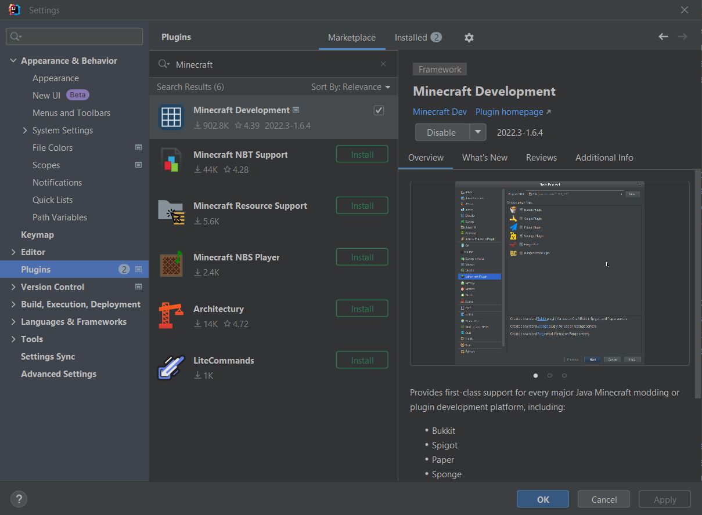
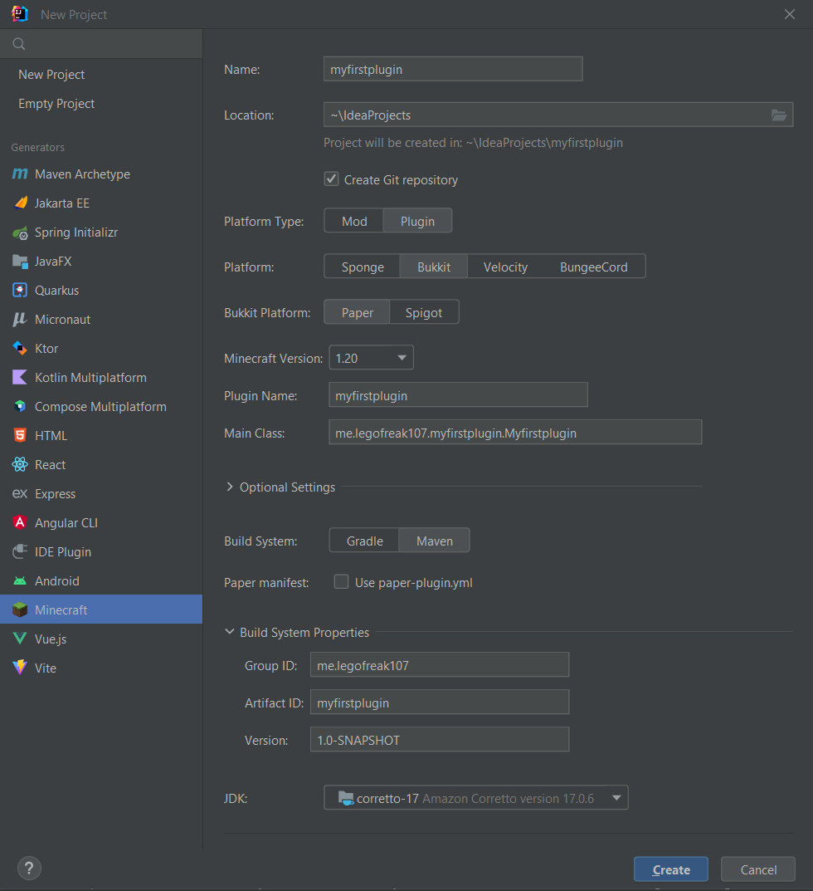

# Les 2: Minecraft / Paper basics #1 #

In deze les gaan we onszelf meer verdiepen in Minecraft en Paper. We gaan een server opzetten. En een plugin maken die een commando heeft. Een heal plugin/tp plugin.


## Wat is Minecraft ##

Vele van jullie zullen het spel Minecraft al kennen. Maar voor de mensen die het nog niet kennen. Minecraft is een spel waarin je in een wereld zit. En je kan hierin van alles doen. Je kan bijvoorbeeld blokken plaatsen en breken. En je kan met deze blokken dingen bouwen. Je kan ook tegen monsters vechten. En je kan met andere spelers spelen. Dit kan op een server. Of lokaal op je eigen computer.

## Welke serveropties hebben we ##

Er zijn een aantal verschillende serveropties. De meest bekende is de officiële server van Mojang. Deze is gratis te downloaden. En is ook de server die Mojang gebruikt voor de officiële Minecraft servers. Deze server is echter niet aan te passen. En heeft ook geen API. Hierdoor kunnen we geen plugins maken voor deze server.
Hierdoor is door de community onder andere Bukkit ontwikkeld. Bukkit is een server die een API heeft. En waar we plugins voor kunnen maken. Deze server is echter niet meer in ontwikkeling. En is ook niet meer te downloaden. Maar er is een fork van Bukkit. Deze heet Paper. En is een doorontwikkeling van Bukkit. Deze server is nog wel in ontwikkeling. En is ook te downloaden. Deze server gaan we gebruiken voor onze plugins.

## Wat is Paper ##

Paper is een serversoftware gebouwd voor Minecraft. Door deze custom software krijg je als developer de mogelijkheid om bestaande functionaliteit aan te passen of uit te breiden. Dit doen we door middel van plugins. Plugins zijn stukjes code die je aan de server toevoegd. En die de server vervolgens uitvoert. Hierdoor kan je bijvoorbeeld een commando toevoegen.

## Minecraft plugin voor Intellij ##

We starten met het installeren van de Minecraft plugin voor Intellij. Deze plugin zorgt ervoor dat we makkelijk een project kunnen maken. En dat we makkelijk kunnen programmeren. Deze plugin is te vinden in de plugin store van Intellij. Deze plugin heet “Minecraft Development”. Deze plugin is gemaakt door “Minecraft Development Team”. Deze plugin is gratis te downloaden.



## Paper server opzetten ##

### Paper jar downloaden ###
Nu we de plugin hebben geïnstalleerd. Kunnen we beginnen met het opzetten van de server. We gaan hiervoor naar de website van Paper. Deze is te vinden op https://papermc.io/downloads/paper. Hier kunnen we de laatste versie van Paper downloaden. We kiezen hier voor de laatste versie van 1.20.1. We downloaden de “Paper-1.20.1.jar”. Deze slaan we op in een map. Maak ergens een map aan gemaakt KZD-JAVA en maak hierin een map genaamd servers. Hierin mag je een map maken genaamd dev-server-1. Hierin plak je de jar die je net hebt gedownload, noem deze server.jar.

### Batch script maken ###
Maak nu in dezelfde map een txt bestand. En noem deze start.bat. Open deze in een text editor. En plak hierin het volgende:
```batch
java -Xms1G -Xmx1G -jar server.jar nogui
pause
```
Hier hebben we een aantal argumenten.<br/><br/>
* ```-xmx1G```: Dit is de maximale hoeveelheid RAM die de server mag gebruiken. Dit is 1GB.<br/>
* ```-xms1G```: Dit is de minimale hoeveelheid RAM die de server mag gebruiken. Dit is 1GB.<br/>
* ```-jar server.jar```: Dit is de jar die we willen uitvoeren. Dit is de jar die we net hebben gedownload.

### Server starten ###
We starten nu de server door het batch script te runnen.
De eerste keer zal je opvallen dat er een eula.txt bestand wordt gegenereerd. 
Open deze in een text editor. En verander de waarde van eula van false naar true.
```txt
#By changing the setting below to TRUE you are indicating your agreement to our EULA (https://account.mojang.com/documents/minecraft_eula).
#Thu Sep 23 15:34:28 CEST 2021
eula=true
```
Start nu de server opnieuw op. En je zult zien dat de server opstart. En dat je een aantal bestanden in je map hebt gekregen. Waaronder een plugins map. Hierin kunnen we onze plugins plaatsen.


## Eerste Minecraft plugin ##

### Project aanmaken ###
We beginnen met een project aanmaken in Intellij met de Minecraft plugin. Dit doen we door naar File -> New -> Project te gaan. En hier te kiezen voor Minecraft Development. En dan voor Plugin. We geven het project een naam. En kiezen voor de laatste versie van Paper. Dan kiezen we voor Java 17. En klikken we op create.



### Plugin.yml ###
Als je het project opent, en kijkt onder src/main/java/resources zie je daar een bestand staan genaamd plugin.yml. Met dit bestand registreren we de specifieke info voor de plugin.
```yml
name: 'MyFirstPlugin' # Naam van de plugin
version: '1.0.0' # Versie van de plugin
main: 'me.<name>.myfirstplugin.MyFirstPlugin' # Main class van de plugin
api-version: 1.17 # Versie van de API
description: 'Les 2 plugin' # Beschrijving van de plugin
author: '<name>' # Auteur van de plugin
```

Hier kunnen we ook commandos registreren.

Commandos registreren doe je als volgt:
```yml
commands: # Commandos van de plugin
  heal: # Naam van het commando
    description: 'Heal commando' # Beschrijving van het commando
    usage: '/heal' # Gebruik van het commando
```

### Main class ###
Navigeer nu naar je main class. Deze staat onder src/main/java/me/<name>/myfirstplugin/MyFirstPlugin.java. Hierin staat al een stukje code. Dit is de code die wordt uitgevoerd als de plugin wordt geactiveerd. We gaan hier nu een commando aan toevoegen. Dit doen we door de volgende code toe te voegen:
```java
@Override
public void onEnable() {
    getCommand("heal").setExecutor(new HealCommand());
}
```

Dit stukje code zal een error geven. Dit komt omdat de class HealCommand nog niet bestaat. Deze gaan we nu aanmaken. Maak een nieuwe class aan. En noem deze HealCommand. Deze class moet de interface CommandExecutor implementeren. Dit doen we door de volgende code toe te voegen:
```java
public class HealCommand implements CommandExecutor {
}
```

Deze class zal nu een error geven. Dit komt omdat we de methode onCommand moeten implementeren. Dit doen we door de volgende code toe te voegen:
```java
@Override
public boolean onCommand(CommandSender sender, Command command, String label, String[] args) {
    return false;
}
```

Deze methode geeft een boolean terug. Deze boolean geeft aan of het commando is uitgevoerd. Of dat er een error is opgetreden. We gaan nu een speler healen. Dit doen we door de volgende code toe te voegen:
```java
@Override
public boolean onCommand(CommandSender sender, Command command, String label, String[] args) {
    if (sender instanceof Player) {
        Player player = (Player) sender;
        player.setHealth(20);
        player.sendMessage("Je bent gehealed!");
    }
    return false;
}
```

Importeer alle classes die je nodig hebt. En je plugin is klaar om te bouwen.

### Plugin bouwen ###
Om de plugin te bouwen. Klik je rechtsboven op de groene play knop. En kies je voor build. Als de plugin is gebouwd. Dan kun je deze vinden onder build/libs. De plugin heet MyFirstPlugin-1.0.0.jar. Deze kun je nu in de plugins map van je server plaatsen. En de server opnieuw opstarten. Als je nu in de server gaat. En je typt /heal. Dan zul je zien dat je wordt gehealed.

## onCommand argumenten ##
We gaan nu een commando maken die een broadcast stuurt. 

We gaan dit doen door een nieuw command te registreren.

plugin.yml
```yml
commands: # Commandos van de plugin
  broadcast: # Naam van het commando
    description: 'broadcast commando' # Beschrijving van het commando
    usage: '/broadcast <message>' # Gebruik van het commando
```

MyFirstPlugin.java
```java
@Override
public void onEnable() {
    getCommand("heal").setExecutor(new HealCommand());
    getCommand("broadcast").setExecutor(new BroadcastCommand());
}
```

BroadcastCommand.java
```java
@Override
public boolean onCommand(CommandSender sender, Command command, String label, String[] args) {
    if (sender instanceof Player) {
        Player player = (Player) sender;
        if (args.length == 0) {
            player.sendMessage("Gebruik /broadcast <message>");
        } else {
            String message = String.join(" ", args);
            Bukkit.broadcastMessage(message);
        }
    }
    return false;
}
```

Bekijk deze code. Wat doen alle regels? En wat gebeurt er als je het commando uitvoert?

Plaats de volgende comments bij de juiste regels code:
```java
// Stuur een bericht naar de speler
// Kijk of er geen argumenten zijn meegegeven
// Stuur een broadcast naar alle spelers
// Voeg de argumenten samen tot 1 string
// Kijk of de sender een speler is
// Cast de sender naar een speler
```

## Teleportatie commando ##
We gaan nu een commando maken die een speler teleport naar een locatie.

Denk hierbij aan alle vorige stappen hierboven.

Enkele tips:
- Kijk of er 3 argumenten zijn meegegeven
- Gebruik de methode Player.getLocation().getWorld() om de wereld van de speler te krijgen
- Gebruik de methode Location(double x, double y, double z, float yaw, float pitch, World world) om een locatie te krijgen
- Gebruik de methode Player.teleport(Location location) om een speler te teleporteren
- Gebruik de methode Player.sendMessage(String message) om een speler een bericht te sturen
- Gebruik Double.parseDouble(String s) om een string om te zetten naar een double
